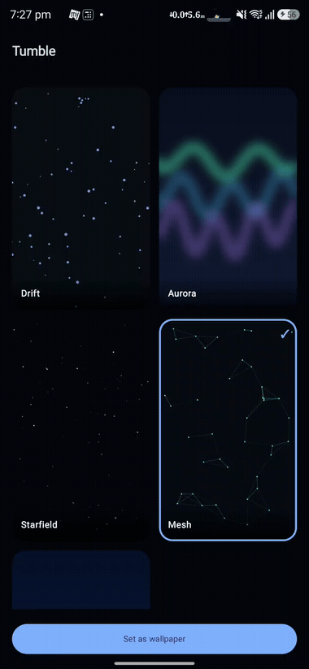

# Kinetic

**A zero-alloc procedural-animation + live-wallpaper engine for Android.**

Drop in a `Scene` — a tiny procedural diorama drawn with plain `android.graphics` —
and render it anywhere: an in-app Compose canvas, a **live wallpaper**, a home-screen
widget, or a notification. One render contract, every surface, no per-frame allocation,
battery-disciplined by default.

<p align="center"></p>

*Live wallpapers built on Kinetic, from the [Tumble](https://github.com/soumyasethy/tumble) app.*


<!--  -->

---

## Why

Building a good Android live wallpaper means re-solving the same problems every time:
a `SurfaceHolder` render loop, Choreographer timing, pausing on `onVisibilityChanged`
so it doesn't drain the battery, and a zero-allocation draw path so it doesn't stutter.
Kinetic does all of that once. You write only the part that's yours — the animation.

- **Zero-alloc render contract** — `render(canvas, w, h, state)`; pools/Paints are fields, never per-frame.
- **Battery-safe wallpaper base** — rendering stops the instant the wallpaper isn't visible.
- **One scene, every surface** — the same `Scene` draws in-app, as a wallpaper, in a widget, in a notification.
- **Deterministic** — seeded `SceneRng`, so the same inputs look identical on every device.
- **Tiny** — pure `android.graphics`, no heavy deps.

## What (modules)

| Artifact | Purpose |
|---|---|
| `io.github.soumyasethy:kinetic-engine` | The `Scene` contract, `SceneState`, seeded `SceneRng`, scaling + colour helpers. |
| `io.github.soumyasethy:kinetic-wallpaper` | `SceneWallpaperService` — a `WallpaperService` that drives any `Scene` (loop + battery pause). Pulls `kinetic-engine` transitively. |
| `kinetic-anim` *(planned)* | Lottie compositing + AGSL runtime-shader scene helpers. |
| `kinetic-notif` *(planned)* | `NotificationListenerService` base + StateFlow bridge for notification-driven scenes. |

## Install

```kotlin
// settings.gradle.kts — until the first Maven Central release, via JitPack:
dependencyResolutionManagement {
    repositories {
        mavenCentral()
        maven { url = uri("https://jitpack.io") }
    }
}
```
```kotlin
// app/build.gradle.kts — wallpaper pulls the engine transitively
implementation("io.github.soumyasethy:kinetic-wallpaper:0.1.0")
// or just the engine, for in-app / widget rendering:
implementation("io.github.soumyasethy:kinetic-engine:0.1.0")
```

## How (quick start)

Write a scene:

```kotlin
class DriftScene : Scene {
    override fun render(canvas: Canvas, w: Float, h: Float, s: SceneState) {
        // animate from s.timeS / s.dtS; draw with pre-allocated Paints. No allocation here.
    }
}
```

Ship it as a live wallpaper — just point the base service at your scene:

```kotlin
class MyWallpaperService : SceneWallpaperService() {
    override fun createScene(): Scene = DriftScene()
}
```

```xml
<!-- AndroidManifest.xml -->
<service android:name=".MyWallpaperService" android:exported="true"
    android:permission="android.permission.BIND_WALLPAPER">
    <intent-filter><action android:name="android.service.wallpaper.WallpaperService" /></intent-filter>
    <meta-data android:name="android.service.wallpaper" android:resource="@xml/wallpaper" />
</service>
```

## Where it's used (sample)

- **Tumble** — a notification physics-sandbox live wallpaper built on Kinetic. *(repo link)*

## Local development

```bash
./gradlew publishToMavenLocal     # then add mavenLocal() to the consuming app
```

## Roadmap

- `kinetic-anim` (Lottie + AGSL shaders), `kinetic-notif` (notification-driven scenes)
- Maven Central release (`io.github.soumyasethy`) via the vanniktech publish plugin at 1.0

## License

Apache-2.0.
